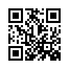

##  Lời nói đầu

Sau khi trở về từ PicoCTF 2023 với không thể nào giải được câu cuối thì năm nay lại khác 🤡 Tuy là đã già tới nơi rồi nhưng mà với niềm đam mê chơi Xê tê ép thì năm nay lại thử tham gia lại lần cuối coi như là last dance. PicoCTF năm nay cũng khá hơn năm ngoái (less stegano more fun)

## Scan Surprise


I've gotten bored of handing out flags as text. Wouldn't it be cool if they were an image instead?


  

Câu đầu thì hơi xàm =))) mình vẫn không biết pico nó cho cái instance để chi, chỉ cần scan mã QR là ra

## Verify


People keep trying to trick my players with imitation flags. I want to make sure they get the real thing! I'm going to provide the SHA-256 hash and a decrypt script to help you know that my flags are legitimate.


## CanYouSee

How about some hide and seek?


## Secret of the Polyglot

The Network Operations Center (NOC) of your local institution picked up a suspicious file, they're getting conflicting information on what type of file it is. They've brought you in as an external expert to examine the file. Can you extract all the information from this strange file?


## Mob psycho


Can you handle APKs?


## endianness-v2

Here's a file that was recovered from a 32-bits system that organized the bytes a weird way. We're not even sure what type of file it is.


## Blast from the past

The judge for these pictures is a real fan of antiques. Can you age this photo to the specifications? Set the timestamps on this picture to 1970:01:01 00:00:00.001+00:00 with as much precision as possible for each timestamp. In this example, +00:00 is a timezone adjustment. Any timezone is acceptable as long as the time is equivalent. As an example, this timestamp is acceptable as well: 1969:12:31 19:00:00.001-05:00. For timestamps without a timezone adjustment, put them in GMT time (+00:00). The checker program provides the timestamp needed for each.


## Dear Diary

If you can find the flag on this disk image, we can close the case for good!
